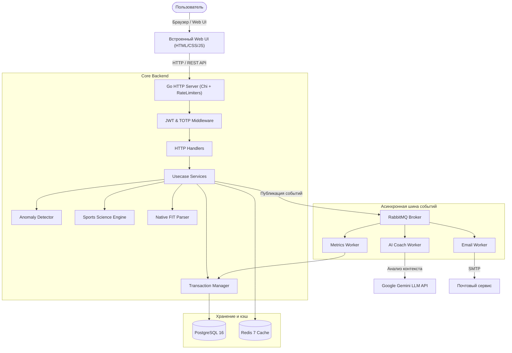

# 🏃 SmartRun — Интеллектуальная платформа спортивной аналитики и персональный AI-тренер для бегунов


**SmartRun** — это высоконагруженная экосистема для бегунов, объединяющая строгую спортивную физиологию, нативный парсинг спортивной телеметрии, событийно-ориентированную микросервисную архитектуру и искусственный интеллект на базе **Google Gemini**.

В отличие от стандартных трекеров, фиксирующих лишь дистанцию и темп, SmartRun отвечает на главный вопрос любого атлета: **«Готов ли мой организм к тяжелой нагрузке сегодня или мне необходим отдых для предотвращения травмы и перетренированности?»**

Проект включает в себя производительный backend на Go, полнофункциональный Web UI с поддержкой темной темы, фоновый воркер-пул на RabbitMQ и готовое окружение Docker Compose.

---

## 💡 Какую проблему решает SmartRun?

Большинство любителей бега тренируются интуитивно: ориентируются на факт выполнения плана, игнорируя скрытую физиологическую усталость, недосып или фоновый стресс. В результате наступает плато, срыв адаптации или травма.

**SmartRun решает это системно:**
1. **Собирает телеметрию из первоисточников** (бинарные файлы `.fit` от Garmin, Polar, Wahoo, Coros или ручной ввод).
2. **Очищает данные от артефактов** при помощи специализированного детектора сенсорных аномалий.
3. **Рассчитывает объективные физиологические маркеры** по моделям спортивной адаптации (Banister / Coggan / Foster): импульс нагрузки (TSS), хронический фитнес (CTL), острую усталость (ATL) и баланс готовности (TSB).
4. **Учитывает субъективные факторы**: шкалу воспринимаемого напряжения (RPE 1–10), вариабельность ритма сердца (HRV), продолжительность и качество сна.
5. **Подключает AI-тренера**, который на основе формул и контекста атлета выдает понятный вердикт на день.

---

## ⚡ Реализованные Killer-фичи

### 1. 🤖 Встроенный AI-тренер на базе Google Gemini LLM
- Асинхронный воркер (`AICoachWorker`) анализирует состояние спортсмена на текущий день: оценку готовности (Readiness), острую усталость (Fatigue), параметры сна, текущий TSB и профиль последних пробежек.
- Модель **Gemini 3.7 Flash** формирует лаконичную и строгую тренерскую директиву (например: проведение качественной скоростной работы, восстановительный легкий кросс или строгий день отдыха).

### 2. 🔬 Математический движок спортивной науки (Sports Science Engine)
- **TSS (Training Stress Score) & Intensity Factor (IF):** расчет стресса тренировки на основе порогового темпа (Threshold Pace / ПАНО), набора высоты (Elevation Gain с конвертацией в эквивалентный кислородный запрос VO2) и персональной шкалы RPE.
- **Модель импульса нагрузки Banister (CTL / ATL / TSB):**
  - **CTL (Chronic Training Load):** 42-дневное экспоненциальное окно накопленного тренировочного объема («фитнес»).
  - **ATL (Acute Training Load):** 7-дневное окно текущей острой нагрузки («усталость»).
  - **TSB (Training Stress Balance = CTL - ATL):** показатель выхода на пик формы.
- **Recovery Time (Время восстановления):** предиктивная модель расчета часов до полного восстановления (от 6 до 42 ч) с калибровкой по объему работы в критических зонах Z4/Z5.
- **Индексы Монотонности и Напряжения (Foster Monotony & Strain):** расчет вариативности тренировочных стимулов за неделю. При высоком показателе монотонности система предупреждает о риске перетренированности.
- **Анализ вариабельности сердечного ритма (HRV RMSSD & SDRR):** отслеживание отклонения текущей ВСР от индивидуальной 14-дневной скользящей медианы.
- **Пульсовые зоны и Training Effect:** автоматический расчет аэробного и анаэробного тренировочного эффекта (0.0–5.0) и определение доминирующего фокуса (*VO2max*, *Anaerobic Power*, *Aerobic Endurance*).

### 3. ⌚ Нативный бинарный парсер FIT-файлов
- Собственная реализация импортера на основе бинарного декодера протокола FIT (Flexible and Interoperable Data Transfer).
- Прямой разбор без внешних облачных API: выгрузка времени в пульсовых зонах (`TimeInZones`), каденса, набора высоты, энергозатрат, вариабельности ритма (SDRR/RMSSD) и аппаратного стресса.

### 4. 🛡 Алгоритмический детектор аномалий (Anomaly Detection)
- Защита математических моделей от сбоев оборудования (потеря сигнала GPS, залипание нагрудного пульсометра).
- Проверка тренировки на сверхчеловеческие показатели (темп быстрее 2:00 мин/км или медленнее 30:00 мин/км, пульс выше 220 или ниже 30 bpm, отрицательные дистанции).
- Аномальные тренировки маркируются статусом `is_anomalous` с описанием причины и **автоматически исключаются из расчетных окон готовности**, предотвращая искажение метрик восстановления.

### 5. ⚡ Событийно-ориентированная архитектура (RabbitMQ + Workers)
- Неблокирующая обработка: при сохранении тренировки транзакция коммитится в PostgreSQL, а событие пересчета публикуется в шину сообщений.
- Независимые потребители (Consumers):
  - `metrics_worker` — фоновый расчет агрегатов и суточных показателей.
  - `ai_coach_worker` — фоновое взаимодействие с Gemini LLM.
  - `email_worker` — асинхронная отправка транзакционных email для сброса паролей.

### 6. 🖥 Готовый интерактивный Web-интерфейс
- Полноценный встроенный фронтенд на чистом CSS/JS без громоздких внешних библиотек (мгновенная загрузка страниц).
- Поддержка темной и светлой темы (`dark/light mode`) с сохранением предпочтений пользователя.
- **Экраны:**
  - **Dashboard:** оперативная сводка за 7 и 30 дней, индикатор готовности и рекомендации.
  - **Тренировки:** журнал пробежек с детализацией пульсовых зон и формой загрузки `.fit` файлов.
  - **Аналитика:** калькулятор произвольных диапазонов и All-Time с возможностью фиксации срезов прогресса.
  - **Daily Metrics:** история суточных показателей восстановления и усталости.
  - **Профиль:** персональные физиологические настройки и управление безопасностью.

### 7. 🔐 Комплексная безопасность и отказоустойчивость
- Двухфакторная аутентификация (**TOTP 2FA**) с отображением QR-кода (Google Authenticator, Authy).
- Аутентификация по схеме JWT (короткоживущий `access_token` на 15 минут + `refresh_token` на 30 дней) с механизмом отзыва сессий.
- Многоуровневый Rate Limiter: защита от брутфорса на эндпоинтах авторизации (5–10 req/min по IP) и лимитирование прикладного API (300 req/min по `user_id`).
- Фоновый планировщик (`gocron`) для регулярной очистки просроченных сессий.
- Graceful shutdown с безопасным закрытием пула соединений БД, брокера и воркеров.

---

## 🏗 Архитектура системы



---

## 🧩 Зачем здесь RabbitMQ, Redis и Circuit Breaker?

Каждый инфраструктурный компонент в SmartRun решает конкретную инженерную задачу. Ниже подробно описано, какую проблему решает каждый из них и что произойдет с системой при его отсутствии:

| Технология | Что решает? | Что сломается без неё? |
|---|---|---|
| **RabbitMQ** *(Брокер сообщений)* | **Асинхронная развязка тяжелых операций:** публикация событий создания/изменения тренировок и сброса паролей. Фоновый пересчет метрик, долгие внешние сетевые вызовы к **Google Gemini API** (от 2 до 8 сек на генерацию совета ИИ) и отправка транзакционных email выносятся из жизненного цикла HTTP-запроса в независимый пул воркеров (`AICoachWorker`, `MetricsWorker`, `EmailWorker`). Клиент мгновенно получает ответ `201 Created`. | **Каскадная деградация и зависание API:** если выполнять обращение к LLM и SMTP синхронно в HTTP-хэндлере, горутины сервера будут блокироваться на секунды. При задержке или сбое Gemini API пользователи получат `504 Gateway Timeout`, очередь входящих запросов переполнит пул соединений, и сервер полностью перестанет отвечать на любые запросы. |
| **Redis** *(Распределенный кэш)* | **Разгрузка реляционной БД и быстрое чтение:** кэширует профили пользователей, частые выборки агрегированных метрик и хранит сессионные данные. Реализован механизм `SetWithJitter` (случайная дельта к TTL), предотвращающий эффект лавинообразного устаревания кэша (**Cache Stampede**). | **Коллапс пула соединений PostgreSQL:** каждый входящий HTTP-запрос (включая middleware проверки прав) будет бить напрямую в базу данных. При росте нагрузки пул `pgxpool` исчерпается, время ответа возрастет в десятки раз, а база данных упрется в лимит по CPU и дисковому I/O. |
| **Circuit Breaker** *(Паттерн «Предохранитель» на `gobreaker`)* | **Отказоустойчивость при сбоях кэша (Fail-Fast):** защищает слой взаимодействия с Redis. Если подряд происходит 5 сетевых сбоев или таймаутов, предохранитель размыкает цепь (`Open`) на 5 секунд. Все последующие запросы к кэшу мгновенно возвращают ошибку без ожидания сетевого таймаута, позволяя системе безопасно обратиться к базе или вернуть дефолтный ответ. | **Исчерпание ресурсов (Goroutine Starvation):** при сетевом сбое или зависании Redis каждый HTTP-запрос висел бы по 5–10 секунд в ожидании таймаута сокета. Тысячи зависших горутин моментально исчерпали бы оперативную память сервера и файловые дескрипторы операционной системы, обрушив весь бэкенд. |

---

## 🚀 Запуск и развертывание

### Вариант 1. Запуск через Docker Compose (Рекомендуемый)

Проект полностью упакован в Docker. Все зависимости (PostgreSQL, Redis, RabbitMQ, миграции и приложение) разворачиваются одной командой:

```bash
docker-compose up --build -d
```

После запуска контейнеров:
- **Web UI & REST API:** доступен по адресу [http://localhost:8080](http://localhost:8080)
- **RabbitMQ Management Dashboard:** доступен по адресу [http://localhost:15672](http://localhost:15672) (логин: `smartrun`, пароль: `smartrun`)
- **PostgreSQL:** порт `5432`
- **Redis:** порт `6379`

> 💡 **Для активации AI-тренера:** добавьте переменную окружения `GEMINI_API_KEY` в секцию `app` файла `docker-compose.yml` или передайте ее в окружение перед стартом.

### Вариант 2. Локальный запуск через Makefile

Если у вас уже запущены PostgreSQL, Redis и RabbitMQ локально:

1. Скопируйте шаблон переменных окружения:
   ```bash
   cp .env.example .env
   ```
2. Накатите миграции базы данных:
   ```bash
   make migrate-up
   ```
3. Запустите сервис:
   ```bash
   make service-run
   ```

---

## 🔐 Конфигурация (.env.example), безопасность секретов и сетевые порты

### 1. Файл шаблона окружения `.env.example`
В корне проекта подготовлен файл [`.env.example`](./.env.example), содержащий полный перечень конфигурационных параметров сервиса:
- `CONN_STRING`, `REDIS_URL`, `RABBITMQ_URL` — строки подключения к инфраструктурным сервисам;
- `JWT_SECRET`, `SECRET_KEY`, `TOTP_MASTER_KEY` — мастер-ключи шифрования и подписи токенов;
- `GEMINI_API_KEY` — ключ доступа к API Google Gemini LLM;
- `SMTP_*` — конфигурация для отправки почты через фоновый `EmailWorker`.

### 2. Секреты и пароли: Development vs Production
> ⚠️ **ПРЕДУПРЕЖДЕНИЕ О БЕЗОПАСНОСТИ:**
> Пароли по умолчанию (`smartrun`), дефолтные строки подключения и значение `JWT_SECRET=dev-only-super-secret-change-me` в конфигурациях предназначены **исключительно для удобства локальной разработки (development / demo)**, чтобы проект разворачивался в один клик без ручного ввода настроек.
>
> **Для Production-окружения строго обязательно:**
> 1. Сгенерировать новые криптографически стойкие ключи:
>    ```bash
>    openssl rand -base64 32
>    ```
> 2. Задать сложные уникальные пароли для PostgreSQL и RabbitMQ;
> 3. Передавать секреты через переменные окружения хоста, CI/CD или секрет-менеджеры (HashiCorp Vault, AWS Secrets Manager, Docker Secrets), исключая их коммит в репозиторий.

### 3. Публикация портов инфраструктуры наружу
В текущей конфигурации `docker-compose.yml` служебные порты проброшены на хост-машину:
- `5432:5432` — PostgreSQL
- `6379:6379` — Redis
- `5672:5672` и `15672:15672` — RabbitMQ (порт брокера и панель администрирования)

**Для локальной разработки это норма:** разработчик может быстро подключиться к БД через DataGrip / DBeaver, проинспектировать кэш через Redis Insight или проверить очереди сообщений в веб-интерфейсе RabbitMQ.

**Для Production-развертывания:**
Публикация портов баз данных и очередей наружу **недопустима**. В production-версии директивы `ports:` для БД, Redis и RabbitMQ удаляются — сервисы остаются доступны исключительно внутри изолированной Docker-сети (`networks`). Наружу пробрасывается только HTTP-порт приложения `8080` (либо защищенный порт `443` через Reverse Proxy типа Nginx / Traefik / Caddy с SSL-терминацией).

---

## 🐳 Особенности Dockerfile и кроссплатформенность (ARM / Mac & Non-Root)

Сборка контейнера оптимизирована под современные стандарты безопасности и кроссплатформенность:

1. **Запуск от непривилегированного пользователя (`USER appuser`):**
   - Контейнер **не работает от root**. В образе Alpine создается отдельная системная группа `appgroup` и пользователь `appuser`, которому передаются права только на директорию `/app`.
   - Это исключает возможность эскалации привилегий на хостовой системе при возникновении потенциальной уязвимости в приложении (принцип Least Privilege).
2. **Поддержка Apple Silicon (Mac ARM64) и мультиархитектурная сборка:**
   - Ранее жестко зашитая директива `GOARCH=amd64` приводила к медленной эмуляции через QEMU / Rosetta на процессорах Apple Silicon (M1/M2/M3/M4) и ARM-серверах.
   - В актуальном `Dockerfile` используются аргументы `ARG TARGETOS` и `ARG TARGETARCH`. Go компилирует бинарный файл нативно под архитектуру процессора хоста (как `linux/arm64`, так и `linux/amd64`), гарантируя максимальную производительность без накладных расходов эмуляции.

---

## 📱 Как взаимодействовать с приложением?

### Сценарий 1: Через веб-интерфейс (Web UI)

1. **Регистрация:** откройте `http://localhost:8080/signup`, создайте учетную запись.
2. **Настройка профиля:** перейдите в раздел **Профиль** (`/profile`) и укажите физиологические параметры:
   - *Пульс покоя* и *Максимальный пульс* (нужны для определения пульсовых зон).
   - *Пороговый темп (ПАНО)* (например, `04:30` мин/км — базовый параметр для расчета TSS и стресса).
   - При желании активируйте **2FA**: отсканируйте сгенерированный QR-код в Google Authenticator.
3. **Добавление тренировки:**
   - Перейдите в **Тренировки** (`/workouts`).
   - Нажмите **«Импорт FIT»** и загрузите тренировочный `.fit` файл с часов, либо нажмите **«Новая тренировка»** для ручного ввода с указанием времени в пульсовых зонах (Z1–Z5) и оценки RPE.
4. **Оценка состояния:**
   - Откройте **Dashboard** (`/dashboard`): вы увидите рассчитанный индекс готовности (Readiness Score), уровень усталости (Fatigue), баланс формы (TSB) и вердикт от **AI-тренера**.
   - Во вкладке **Аналитика** (`/metrics/analytics`) стройте срезы за любые выбранные интервалы дат или All-time.

---

### Сценарий 2: Через REST API

Все эндпоинты разделены на публичные и защищенные JWT-токеном в заголовке `Authorization: Bearer <token>`.

#### Основные эндпоинты

| Метод | Путь | Описание | Защита |
|---|---|---|---|
| `POST` | `/api/register` | Регистрация нового атлета | Публичный (Rate Limit) |
| `POST` | `/api/login` | Вход и получение пары токенов | Публичный (Rate Limit) |
| `POST` | `/api/verify-2fa` | Подтверждение входа кодом TOTP | Публичный |
| `POST` | `/api/refresh` | Обновление Access-токена | Публичный |
| `GET` | `/api/me` | Получение профиля спортсмена | JWT |
| `PUT / PATCH` | `/api/me` | Обновление физиологических параметров | JWT |
| `POST` | `/api/workouts` | Создание тренировки (включая FIT multipart) | JWT |
| `GET` | `/api/workouts` | Список тренировок с пагинацией и фильтрами | JWT |
| `GET` | `/api/workouts/history` | Помесячная история тренировок | JWT |
| `GET` | `/api/workouts/{id}` | Детальные данные пробежки и пульсовых зон | JWT |
| `DELETE` | `/api/workouts/{id}` | Удаление пробежки с каскадным пересчетом | JWT |
| `GET` | `/api/daily-metrics` | Получение суточных метрик готовности и TSB | JWT |
| `GET` | `/api/metrics` | Агрегированные метрики за период | JWT |

#### Пример запроса создания тренировки через `curl`:

```bash
curl -X POST http://localhost:8080/api/workouts \
  -H "Authorization: Bearer YOUR_ACCESS_TOKEN" \
  -H "Content-Type: application/json" \
  -d '{
    "date": "2026-03-25",
    "distance": 12.5,
    "duration": 3600,
    "type_activity": "running",
    "avg_hr": 152,
    "max_hr": 174,
    "rpe": 7,
    "feel": 8,
    "elevation_gain": 85,
    "hr_zones": {
      "zone_1_seconds": 300,
      "zone_2_seconds": 1200,
      "zone_3_seconds": 1500,
      "zone_4_seconds": 600,
      "zone_5_seconds": 0
    }
  }'
```

---

## ⚙️ Структура проекта

```text
.
├── cmd/
│   ├── app/                # Точка входа: инициализация пулов, RabbitMQ воркеров, gocron и сервера
│   └── server/             # HTTP сервер: маршрутизация Chi, rate limiters, статика
├── internal/
│   ├── adapter/
│   │   ├── importer/fit/   # Нативный парсер бинарных FIT-файлов
│   │   └── llm/            # Интеграция с Google Gemini API (AI Coach)
│   ├── broker/rabbitmq/    # Publisher и Consumer для очередей сообщений
│   ├── calculate/          # Математика: TSS, Banister CTL/ATL/TSB, Recovery, HRV, Training Effect
│   ├── handler/http/       # HTTP-хэндлеры (Auth, Workouts, Metrics, Daily Metrics)
│   ├── middleware/         # Аутентификация JWT, rate limiting, контекстное логирование
│   ├── repository_impl/    # Реализации репозиториев PostgreSQL и менеджера транзакций
│   ├── usecase/service/    # Прикладная бизнес-логика
│   ├── validate/           # Валидаторы входных данных и детектор аномалий
│   └── worker/             # Фоновые воркеры (AI Coach, Metrics Recalculator, Email)
├── migrations/             # SQL-миграции PostgreSQL
├── ui/
│   ├── static/             # Стили CSS и клиентский JavaScript (темы, графики, API-клиент)
│   └── templates/          # HTML-шаблоны экранов приложения
├── docker-compose.yml      # Декларация контейнеров (App, Postgres, Redis, RabbitMQ, Migrate)
├── Dockerfile              # Мультистейдж сборка легковесного production-образа
└── Makefile                # Команды быстрого запуска и управления миграциями
```

---

## 🏆 Итог

**SmartRun** — это не учебный шаблон, а готовая к эксплуатации сервисная платформа, демонстрирующая лучшие инженерные практики:
- Чистая архитектура и разделение ответственности по слоям;
- Продвинутая прикладная математика на стыке с реальной спортивной физиологией;
- Надежная асинхронная обработка тяжелых задач через очереди сообщений;
- Интеграция передовых генеративных языковых моделей (LLM) для решения прикладных задач пользователя.
